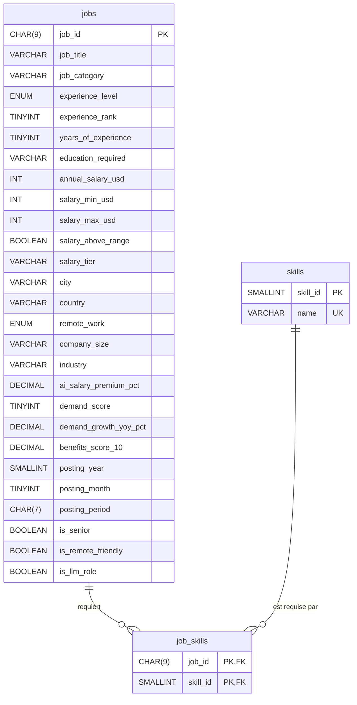

# Conception de la base de données

## 1. Choix de la technologie : MySQL

### Pourquoi MySQL est adapté à ce projet

1. **Les données sont tabulaires et leur schéma est stable.** Les 1 500 offres ont toutes les mêmes 25 colonnes, sans valeur manquante ni structure imbriquée (hormis les compétences). Une table relationnelle les représente directement, et les types stricts (`INT`, `DECIMAL`, `BOOLEAN`, `ENUM`) ainsi que les contraintes `CHECK` rejettent toute donnée invalide dès l'import.
2. **Le dashboard repose sur des agrégations filtrées.** Toutes les visualisations demandées (salaire par métier, par pays, par niveau d'expérience, répartition du télétravail…) sont des `GROUP BY` combinés à des `WHERE` sur 5 filtres. SQL exprime ces requêtes de façon déclarative et les index sur les colonnes filtrées les accélèrent.
3. **Les compétences forment une relation plusieurs-à-plusieurs.** Une offre requiert plusieurs compétences (6,4 en moyenne) et une compétence apparaît dans plusieurs offres (Python : 942). La table de liaison `job_skills` avec clés étrangères garantit l'intégrité (pas de compétence orpheline, pas de doublon grâce à la clé primaire composée) et le « top compétences » devient une simple jointure.

### Limites dans ce contexte

- **La liste de compétences doit être éclatée à l'import** : le champ `required_skills` (`Python|SQL|…`) est transformé en lignes de `job_skills`. MongoDB l'aurait stocké tel quel dans un tableau du document, sans étape de normalisation.
- **Pas de fonction `MEDIAN` native** : la médiane des salaires (KPI obligatoire) nécessite une requête avec fonctions de fenêtre (`ROW_NUMBER() OVER`), plus verbeuse qu'un simple agrégat.
- **Schéma rigide** : ajouter une colonne au dataset impose de modifier la table (migration), là où MongoDB accepterait des documents hétérogènes.

### Pourquoi pas MongoDB ici

MongoDB serait pertinent pour des documents hétérogènes, des écritures massives ou une montée en charge horizontale. Aucun de ces besoins n'existe : les données sont homogènes, chargées une seule fois et uniquement lues.

## 2. Modèle logique



| Table | Lignes | Rôle |
|---|---|---|
| `jobs` | 1 500 | Une ligne par offre, toutes les variables sauf les compétences |
| `skills` | 93 | Référentiel des compétences distinctes |
| `job_skills` | 9 428 | Liaison offre ↔ compétence (après dédoublonnage, cf. D1) |

### Choix de modélisation

- **`required_skills`** est normalisé en `skills` + `job_skills` (décision D9). La colonne d'origine n'est pas conservée dans `jobs` pour éviter une double source de vérité.
- **Pas de tables de référence** pour `country`, `industry`, `job_category`… : ce sont de simples libellés sans attribut propre. Des tables séparées ajouteraient des jointures sans bénéfice. Leurs domaines sont contrôlés par le script de nettoyage (D8) et, pour les plus petits, par un `ENUM`.
- **`ENUM`** pour `experience_level` et `remote_work` : domaines courts et figés, rejet automatique d'une valeur inconnue.
- **Colonnes ajoutées** au nettoyage : `experience_rank` (tri logique Entry → Lead), `posting_period` (`AAAA-MM`), `salary_above_range` (salaire au-dessus de la fourchette de référence du métier).

### Index

| Index | Justification |
|---|---|
| `PRIMARY KEY (job_id)` | Identifiant unique de l'offre |
| `country`, `job_category`, `experience_level`, `industry`, `remote_work` | Les 5 filtres obligatoires du dashboard |
| `job_title` | Filtre « métier » et agrégations par métier |
| `UNIQUE (skills.name)` | Une compétence n'existe qu'une fois |
| `PRIMARY KEY (job_id, skill_id)` | Interdit les doublons de compétence par offre |
| `job_skills (skill_id)` | Jointure inverse pour le top compétences |

Avec 1 500 lignes, l'effet des index est négligeable en pratique ; ils documentent surtout les axes d'interrogation prévus et deviendraient utiles si le volume augmentait.

## 3. Stratégie d'import

```
data/ai_jobs_market_2025_2026.csv
        │
        │  docker build (étape « prepare », image python:3.12-slim)
        ▼
scripts/cleaning.py ──► jobs.csv, skills.csv, job_skills.csv
        │
        │  docker build (étape finale, image mysql:8.4)
        ▼
/var/lib/mysql-files/*.csv          (dossier autorisé par secure_file_priv)
/docker-entrypoint-initdb.d/
    01_schema.sql   ── crée les tables
    02_import.sql   ── LOAD DATA INFILE des 3 CSV
        │
        │  premier démarrage du conteneur (volume vide)
        ▼
base ai_jobs prête
```

- **Reproductible** : l'image de la base est construite à partir du CSV brut ; aucune étape manuelle.
- **Le nettoyage est fait en Python** (testé unitairement) et **le chargement en SQL** (`LOAD DATA INFILE`, rapide et natif).
- **Exécuté une seule fois** : l'image officielle MySQL ne lance les scripts de `/docker-entrypoint-initdb.d` que si le volume de données est vide. Pour réimporter : `make db-reset` (supprime le volume).
- Le CSV n'est utilisé **qu'à l'import** : le dashboard interroge exclusivement MySQL.

## 4. Requêtes du dashboard

Voir [`database/requetes_dashboard.sql`](../database/requetes_dashboard.sql) : 10 requêtes couvrant les KPI obligatoires (dont la médiane) et les visualisations prévues.
